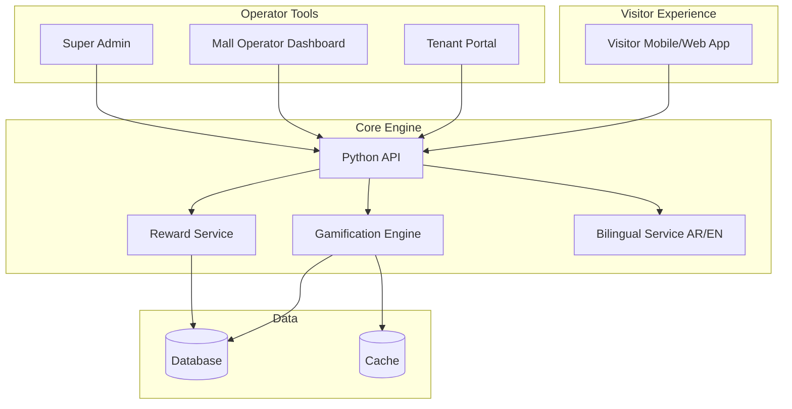

# 🎮 MallQuest

### Deerfields Mall Gamification System

*Hamster-Kombat-style engagement • Bilingual (AR/EN) • 4 dashboards • Real-time rewards*

[Features](#-features) • [Architecture](#-architecture) • [Dashboards](#-four-dashboards) • [Licensing](#-licensing--contact)

---

## 💡 Overview

**MallQuest** is an integrated **gamification & engagement platform** built for Deerfields Mall. It delivers an interactive experience to visitors with mechanics inspired by viral games like Hamster Kombat — tap-to-earn, daily quests, leaderboards, and tier-based rewards — all wired into the mall's real tenant ecosystem.

> Turn every mall visit into a game. Increase footfall, dwell time, and tenant cross-traffic.

---

## ✨ Features

### 🎯 Core Engagement
- **Tap-to-earn** mechanics with combo multipliers
- **Daily quests** tied to specific stores or zones
- **Leaderboards** — global, friends, and weekly resets
- **Achievement system** with collectible badges
- **Tier progression** unlocking exclusive perks

### 🌐 Bilingual
- Full Arabic + English UI
- RTL layout support
- Localized content & notifications

### 🎁 Reward Engine
- Mall-credit, tenant discounts, exclusive offers
- QR-code redemption at tenant POS
- Anti-fraud and rate-limit safeguards

### 🏬 Four Separate Dashboards
- **Visitor App** — game UI, quests, rewards wallet
- **Tenant Portal** — claim redemptions, offer creation
- **Mall Operator** — campaign management, analytics
- **Super Admin** — full system configuration

---

## 🏛️ Architecture

---

## 🏬 Four Dashboards

| Audience | Purpose |
|---|---|
| 🛍️ **Visitor** | Play, earn, redeem |
| 🏪 **Tenant** | Validate redemptions, run offers |
| 🏢 **Mall Operator** | Launch campaigns, track engagement metrics |
| 👑 **Super Admin** | Configure mechanics, manage tenants, audit |

---

## 🛠️ Tech Stack

| Layer | Technology |
|---|---|
| **Backend** | Python |
| **Frontend** | Bilingual (AR/EN) web UI |
| **Gamification** | Custom engine with combos, quests, leaderboards |
| **Rewards** | QR-based redemption flow |

---

## 📸 Screenshots

> 🖼️ *Coming soon — visitor game UI, tenant portal, operator analytics.*

---

## 📄 Licensing & Contact

This is **proprietary commercial software**. See [LICENSE](./LICENSE).

**Available for:**
- 🏬 Mall licensing & white-label deployment
- 🎮 Custom gamification mechanics for retail
- 🤝 Tenant network integration partnerships

📧 **moslehmohammad2@gmail.com**
🐙 [github.com/Mosleh92](https://github.com/Mosleh92)

---

⭐ *Star this repo if you find it useful!*

